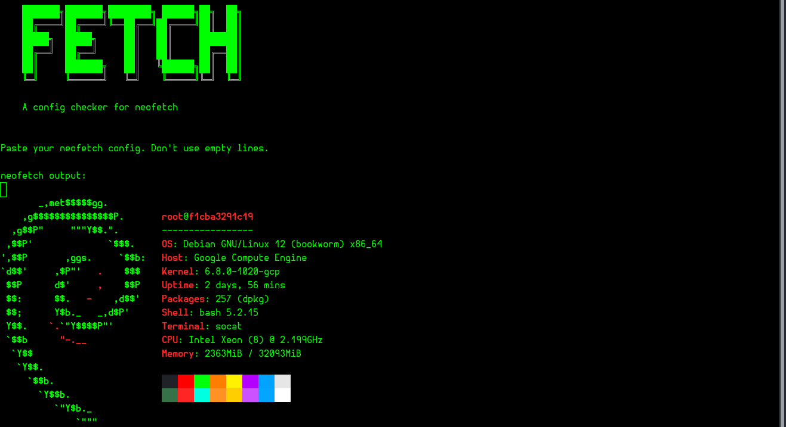
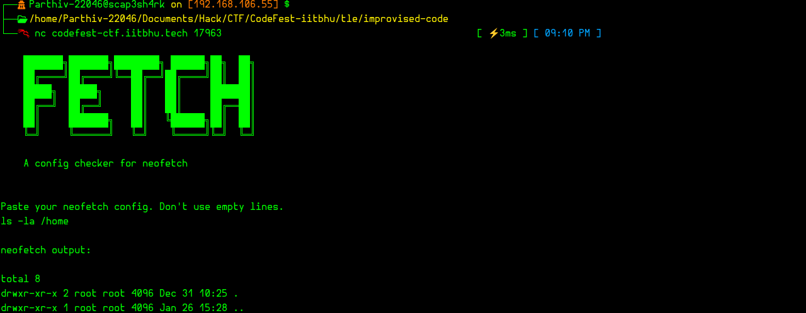
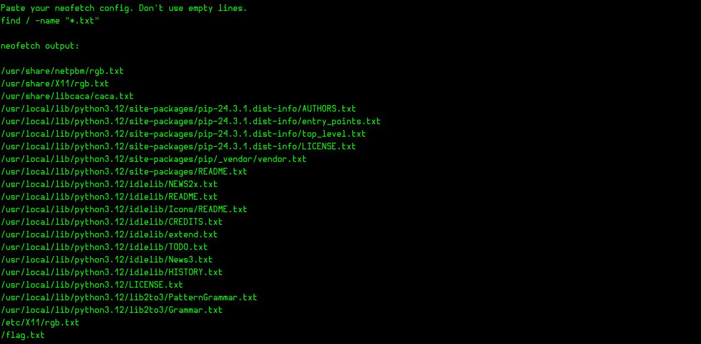
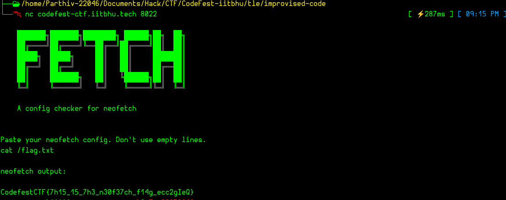

# Fetch


The code suggests that the config file is executed and showed up in the instance.

## About neofetch
Neofetch is a command-line system information tool written in Bash. It displays information about your system alongside an ASCII logo of your operating system, making it visually appealing for users. The tool is highly customizable, allowing users to configure what details to display, such as the operating system, kernel, uptime, packages, shell, and more. Neofetch is commonly used by Linux users to showcase their setups in screenshots or for quick system diagnostics.

## Initial thoughts
Since we are given some input field and we are asked not to leave any empty lines, I just tried leaving one blank intentionally to observe its behavior. 



This made me try to execute a command in here:



It's working! I then decided to search for all the `.txt` files in the remote server since the flag is likely stored in one of them. The command I used was:

```bash
find / -name "*.txt"
```

### Breakdown
- `find`: The command used to search for files and directories.
- `/`: The starting directory for the search. Here, `/` indicates the root directory, meaning the search will encompass the entire filesystem.
- `-name "*.txt"`: The search pattern, which looks for files with a `.txt` extension.

After executing the command, I got a list of all `.txt` files. Among them, I found a `flag.txt` in the root directory and decided to view its contents.



Here is the flag:


