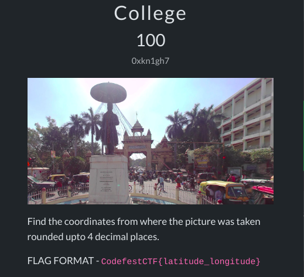
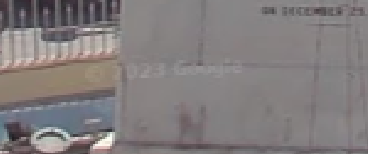
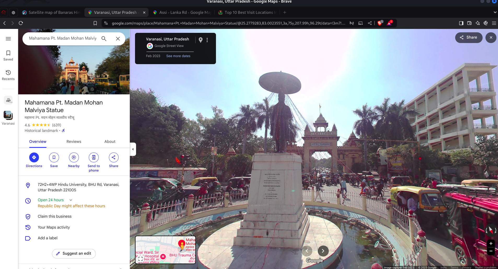

# Osint/College 

This challange is to find out the coordinates rounded off to 4 decimal places of their latitude and longitude.

## Exiftool
I First tried to get the metadata using `exiftool`
```bash
exiftool chall.png
```
I didnot get any latitude and longitude information in the metadata.

## Google Maps
After that I have observed that there is a google copyright watermark on the picture and i searched for the place using google lens.

I got to know the place and opened up the google maps for the plcae in the street view.
After setting up the correct place in the street view, the url shows up the latitude and longitude. and thats it.

here is the url 
```url
https://www.google.com/maps/place/Mahamana+Pt.+Madan+Mohan+Malviya+Statue/@25.2779283,83.0023551,3a,75y,207.99h,96.29t/data=!3m7!1e1!3m5!1sYCtz2HEK0Ypyh4xqSK1wjw!2e0!6shttps:%2F%2Fstreetviewpixels-pa.googleapis.com%2Fv1%2Fthumbnail%3Fcb_client%3Dmaps_sv.tactile%26w%3D900%26h%3D600%26pitch%3D-6.290276780738992%26panoid%3DYCtz2HEK0Ypyh4xqSK1wjw%26yaw%3D207.99239061273164!7i13312!8i6656!4m14!1m7!3m6!1s0x398e3161bed9e201:0xda952bada7968eaf!2sMahamana+Pt.+Madan+Mohan+Malviya+Statue!8m2!3d25.277836!4d83.0023162!16s%2Fg%2F11btmqg1yv!3m5!1s0x398e3161bed9e201:0xda952bada7968eaf!8m2!3d25.277836!4d83.0023162!16s%2Fg%2F11btmqg1yv?hl=en&entry=ttu&g_ep=EgoyMDI1MDEyMi4wIKXMDSoASAFQAw%3D%3D
```
```Lat Long
25.2779 83.0024
```
